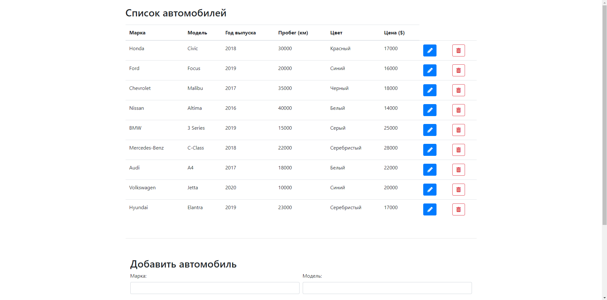

# ООП, 4 сем, лаб 5, вариант 2
Для проекта, разработанного в лабораторной работе 4, вместо сохранения объектов в JSON, реализовать сохранение в БД (в данном случае MySQL). Должны быть все четыре элемента CRUD.

### Обновленный дизайн сайта для доп. функций

